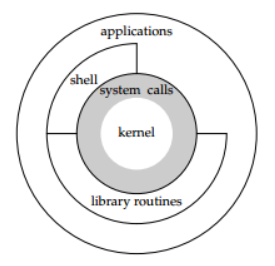

# 2_linux架构图和查看内核信息

## linux架构图



1. kernel（linux内核）：

   1. 管理硬件资源：如CPU、内存、外部设备等。

   2. 为上层应用软件提供运行环境。

2. system calls（系统调用）：内核对上层应用程序提供的接口。

3. shell（命令解析器）：本质上也是一个程序，用于解析命令、执行命令。脚本(script)是命令的集合。

4. library routines（库函数）：库函数实际上是系统调用的一个封装，一个库函数可能包含一个或者多个系统调用，当然也有可能不包含系统调用，因为有的操作不需要涉及到内核的功能。

5. applications（应用程序）

注意：应用程序可以通过`shell--->system calls--->kernel`来访问内核，也可以通过`library routinues--->system calls--->kernel`访问内核，同样可以通过`system calls--->kernel`。


## linux的发行版本

Linux的发行版本：linux内核+其他支撑软件

如ubuntu就是其一。


## 查看内核信息

使用的是`uname`命令，可以通过`man 1 uname`来查看其详细的信息。

`uname`：打印系统信息。

如：`uname -a|(--all)`表示查看所有信息。

```shell
Linux jt 5.4.0-74-generic #83-Ubuntu SMP Sat May 8 02:35:39 UTC 2021 x86_64 x86_64 x86_64 GNU/Linux

解释：
Linux:内核名字
jt：网络节点的名字
5.4.0-74-generic：操作系统的发行版号
#83-Ubuntu SMP Sat May 8 02:35:39 UTC 2021：内核版本
x86_64：硬件平台
x86_64：机器硬件名
x86_64：系统处理器的体系结构
GNU/Linux：操作系统
```

具体的其他命令可以借助`man uname`查看。

注：发行版版本的查看：`cat /etc/issue`。
