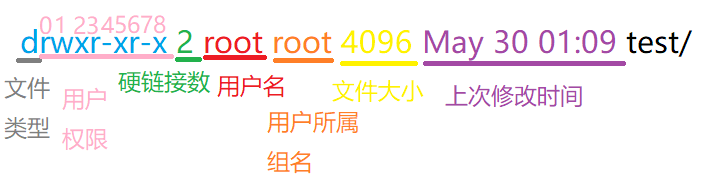

# 5_文件权限

## 文件类型和用户权限

首先我们随意使用`ls -l`来查看当前路径下的文件夹。如以下内容：



- 文件类型：

  - d：directory，表示目录文件
  - -：file，普通文件
  - l：symbolic link，符号链接（软连接）
  - c：字符设备（如键盘）
  - b：块设备（如硬盘）
  - p：管道文件（进程之间通信）
  - s：套接字文件（网络通信）

- 用户权限：

  - 012的位置：表示用户user的权限
  - 345的位置：表示用户组group的权限
  - 678的位置：表示其他用户others的权限

  - 文件的权限有三种，依次是读r、写w和执行x

  - 从上面`ls -l`的打印结果中可得知，这三种权限还会根据用户的身份而有所不同。

1. 如何判断某个用户能否读取/修改/执行文件？

`先判断当前用户和文件之间的身份关系，然后再检查文件的权限位`

2. 如何判断某个用户能否删除文件？

`先找到文件所在目录，判断当前用户是否拥有目录的写权限`


## chmod命令修改权限

使用`chmod`可以修改文件的权限，`chmod`命令比较灵活，它拥有比较多种使用模式：

1. 文字设定法

```shell
chmod [u|g|o|a][+|=|-][r|w|x] file/dir
# [u|g|o|a]，u表示用户，g表示组成员，o表示其他用户，a表示所有用户
# [+|=|-]，+表示添加某个权限，-表示取消某个权限，=表示设置成某种权限
# [r|w|x]，r表示可读，w表示可写，x表示可执行

注：可以在一行语句中对某个文件调整多次权限，使用逗号来分隔用户操作类型即可
```

2. 数字设定法

   1. 通常文件的权限是采用于位图的形式来进行存储，3位的2进制数字可以用来表示文件的读写执行权限，9位的2进制数字就可以表示文件的所有用户权限。
   2. 在3位2进制数中，通常使用最高位表示读权限，随后是写权限，最低为是执行权限。然后再将ugo组合起来，就能得到一个9位2进制数字，最后按照8进制和2进制的转换方法，文件权限就能很轻松地用3位8进制数字来表示。
   3. 例如`0644`对应的二进制数是`110` `100` `100`，即用户可读可写不可执行，组用户和其他用户可读不可写不可执行。

   ```shell
   chmod 三位8进制数 file/dir
   ```

   

## umask掩码

`umask`命令，获取或设置文件创建时的掩码

当普通用户使用`umask`命令时默认显示的掩码是`0022`，即是个八进制数。而root用户则是`0002`

我们要知道，文件在创建时，默认的权限信息是0666，目录则是0777，但是在创建时要根据掩码，与掩码作运算后，才能得到真正创建的权限。

- 创建文件夹时默认的权限是777&(~umask)
- 创建普通文件时默认的权限是666&(~umask)

当然，我们也可以修改掩码值，`umask 掩码值（三位8进制数）`，但是这种操作是临时的，如果要永久修改，则需要修改配置文件（例如~/.bashrc)。


## 权限会影响的行为

- r读，会影响的操作有
  - cat
  - cp时的源文件
  - 目录的子主题的名字和类型
- w写，会影响的操作有
  - 重定向的目标
  - cp时的目标文件
  - 目录，会影响文件的添加和删除
- x执行，会影响的操作有
  - ./文件名
  - 目录，影响cd命令
